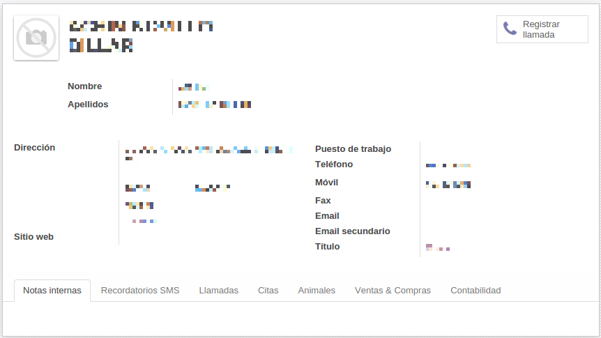
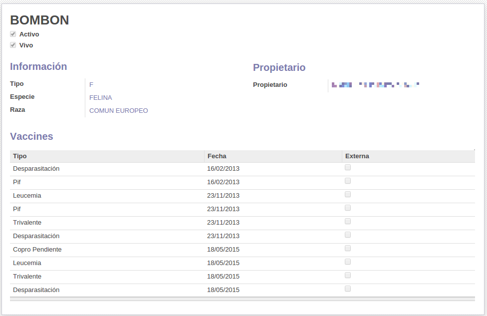
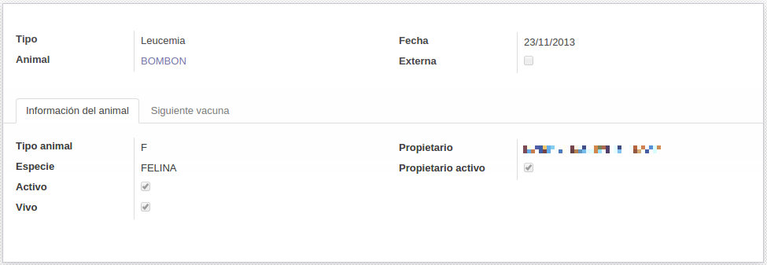
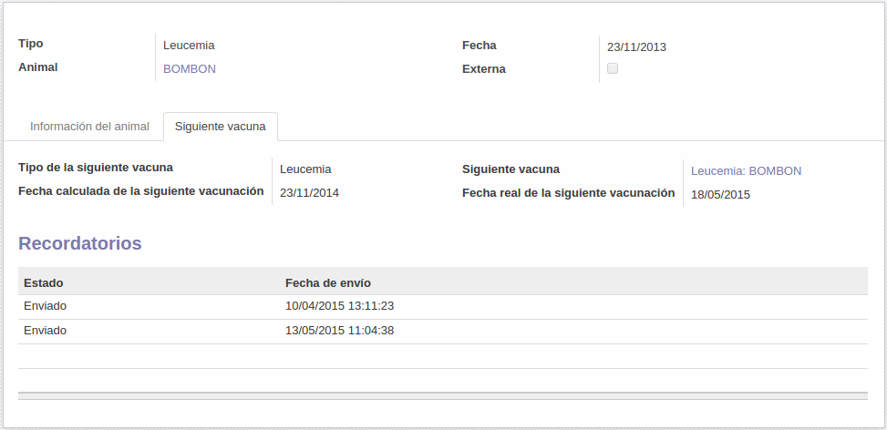
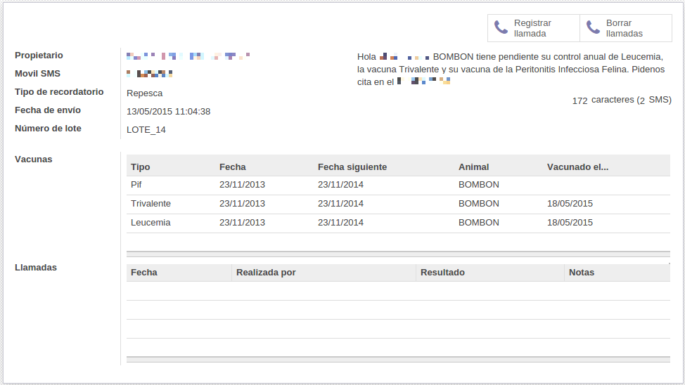
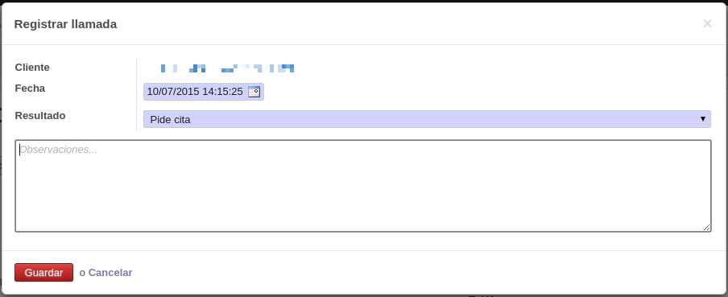
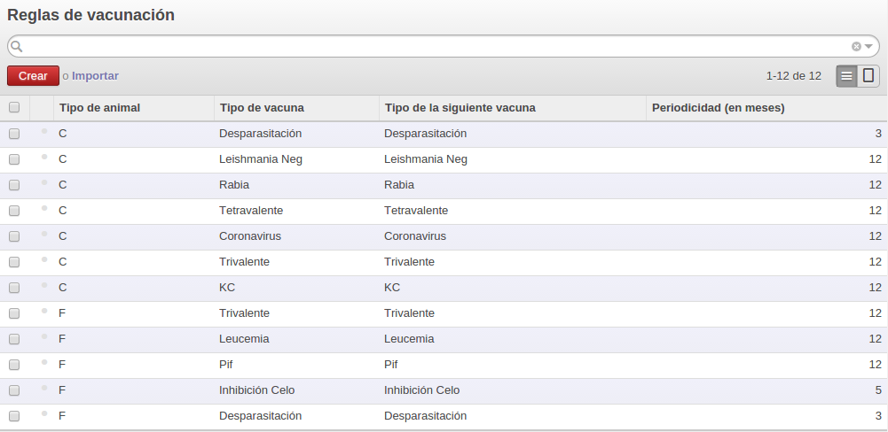
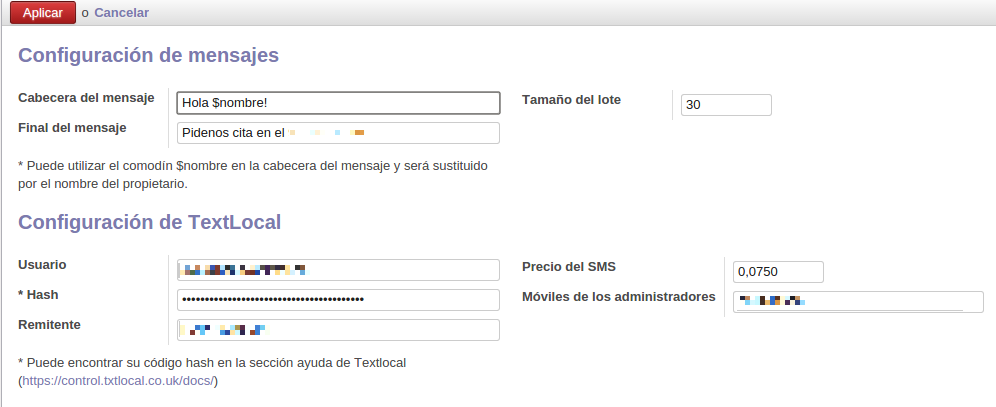
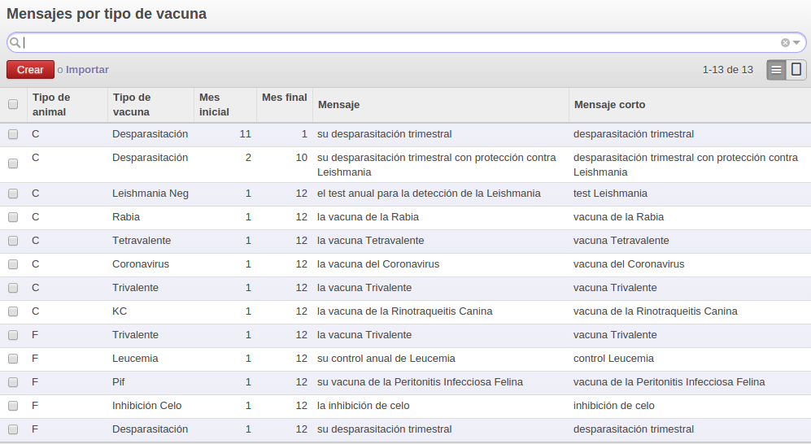

# SOHOVet
Gestión de clínicas y hospitales veterinarios con Odoo

## Índice
- [Introducción](#intro)
- [Instalación](#install)
- [Módulo de vacunación](#vaccines)

## <a name="intro"></a> Introducción
SOHOVet contiene un conjunto de módulos para Odoo (www.odoo.com) que permite la gestión de clínicas y hospitales veterinarios.

Versión inicial:
 - Compras a proveedores.
 - Gestión de precios basados en margen sobre el precio final.
 - Exportación e importación de productos en formato xlsx para facilitar la modificación o incorporación de productos en lote.
 - Gestión de propietarios y animales.
 - Módulo de vacunación con posibilidad de definir reglas de vacunación y generar recordatorios de vacunas pendientes.
 - Permite la conexión con el proveedor TextLocal para el envío de SMS con los recordatorios de vacunación.

## <a name="install"></a> Instalación
> **Nota:**

> Se instalarán también los siguientes módulos de python mediante `pip` (<http://www.pip-installer.org/>):
> - boto: Interfaz en python para Amazon AWS http://docs.pythonboto.org/
> - xlsxwriter: Librería para escribir ficheros XLSX en python. https://xlsxwriter.readthedocs.org/

Para empezar a utilizar SOHOVet deberá partir de una instalación de Odoo.


1. Descargar los módulos e instalar las dependencias.

```sh
    $ git clone https://github.com/sohovet/sohovet.git
    $ pip install -r requirements.txt
```

## <a name="vaccines"></a> Módulo de vacunación


Desde el menú principal se puede añadir, editar o eliminar propietarios (clientes), animales y vacunas. También se tiene acceso a los recordatorios SMS, a todas las llamadas realizadas (sólo el usuario administrador) y a las llamadas pendientes de realizar.

También se añade opciones de configuración para el usuario administrador.

### Animales
#### Propietarios
La ficha de propietarios extienda la vista de clientes de Odoo añadiendo pestañas que dan acceso a los animales del cliente, SMS y llamadas registradas y las citas del cliente. También se añade un botón para registrar una nueva llamada al cliente.



#### Animales
La ficha de animales da información básica sobre los animales así como las vacunas que se le han administrado. El tipo de animal permite definir distintos tipos de animales (gatos, perros, ...) y se utiliza principalmente para generar diferentes reglas de vacunación de acuerdo al tipo de animal.



### Vacunas
La ficha de vacunas nos da información sobre las vacunas administradas a un animal. La opción externa nos permite registar vacunas que no han sido administradas en nuestro centro.



En la pestaña "Siguiente vacuna" se puede ver la fecha calculada en la que el animal debe volver a ser vacunado (de acuerdo a las reglas de vacunación). También nos indica si esa vacuna ha sido ya administrada y en qué fecha se hizo.

En la parte inferior nos muestra también los recordatorios SMS enviados al propietario para informarle de la necesidad de administrar la siguiente vacunación.



### Recordatorios
#### Recordatorios SMS
Un recordatorio SMS es un mensaje a un cliente en el que se le recuerdan las vacunas pendientes para todos sus animales.

La ficha del recordatorio SMS nos muestra información sobre el propietario, las vacunas pendientes que han sido notificadas y la lista de llamadas que se han realizado al cliente referentes a este recordatorio.



El asistente "Generar recordatorios" nos permite generar todos los recordatorios SMS pendientes de enviar para un rango de fechas determinado. El tipo de recordatorio puede ser "inicial" o de "repesca". Los recordatorios iniciales se generan para todos los clientes que tienen animales con vacunas pendientes y estas vacunas todavía no han sido notificadas. Los recordatorios de repesca se generan para aquellos clientes que han recibido un recordatorio inicial, pero no han administrado las vacunas a sus animales.


El asistente "Enviar lote" nos permite enviar un lote de tamaño determinado de recordatorios SMS previamente generados con el asistente "Generar recordatorios". Desde este asistente también podemos descargar una hoja de cálculo con los SMS que se van a enviar.
> **Nota:**

> El usuario administrador tiene también la opción de enviar todos los SMS pendientes.


#### Llamadas
Las llamadas a clientes se realizan para notificar al cliente que sus animales tienen vacunas pendientes.

> **Nota:**

> Las llamadas son un medio secundario de comunicación y están asociadas a un recordatorio SMS previo. 
> No se puede registrar una llamada si no se le ha enviado antes un recordatorio SMS.

#### Clientes a llamar
Mediante el asistente "Clientes a llamar" podemos generar una lista de clientes a los que es necesario llamar. En el asistente debemos seleccionar un lote de mensajes (de repesca). También podemos marcar si queremos que en ese listado aparezcan o no clientes a los que ya se les ha llamado, pero no fue posible contactar con ellos.
> **Nota:**

> La lista de clientes a llamar contiene los clientes que cumplen los siguientes requisitos:
> - Han sido notificados por SMS en la fecha que se selecciona en el asistente.
> - No han administrado a sus animales ninguna de las vacunas que se notificaron en el SMS.
> - No tienen registradas citas con fecha posterior al envío del SMS.
> - No se les ha registrado previamente otra llamada referente al SMS. Si no se ha marcado la opción "Excluir clientes imposible contactar" también aparecen aquellos con llamadas registradas con el resultado "Imposible contactar".


Una vez generada la lista de clientes a llamar podemos acceder a las fichas de los clientes. Desde esta ficha podemos registrar una llamada nueva. Esta llamada se asociará al último recordatorio enviado.

El asistente para registar una llamada nos permite almacenar el resultado de una llamada. El resultado de una llamada puede ser uno de los siguientes:
- Imposible contactar.
- No volver a llamar.
- Vacunado en otro centro.
- Pide cita.
- Propietario dado de baja.
- Animal/es dados de baja.




### Configuración
#### Animales

En el submenú "Animales" dentro del menú de configuración se configuran los tipos de animales, especies y razas.

#### Tipos de vacuna
En la opción "Tipos de vacuna" se configuran los distintos tipos de vacuna que registraremos en el sistema.

#### Reglas de vacunación
Las reglas de vacunación nos permiten definir la periodicidad con la que un animal debe ser vacunado.
> **Ejemplo:**

> En los animales de tipo C (Can) la vacuna de la rabia se administra con una periodicidad de 12 meses.



#### Configuración de mensajes
En la opción "Configuración de mensajes" podemos configurar diversas opciones relativas a los mensajes SMS. En este misma página se configuran los datos de la cuenta de TextLocal para el envío de SMS.



En la opción "Mensajes por tipo de vacuna" se establece el texto que se utiliza en la generación de los SMS.


